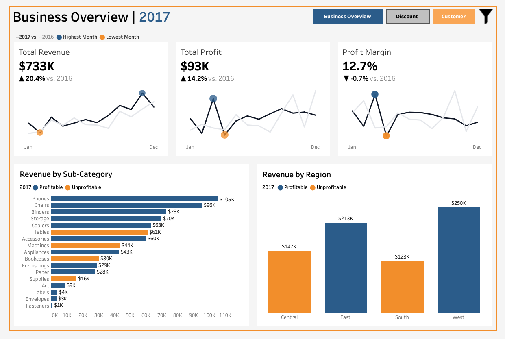
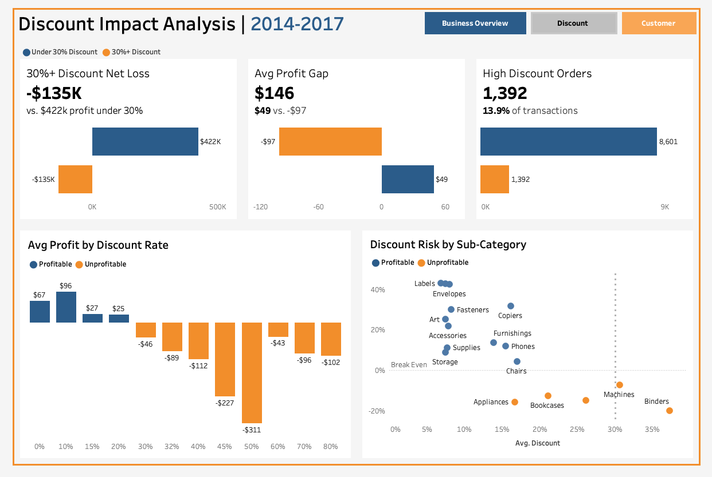
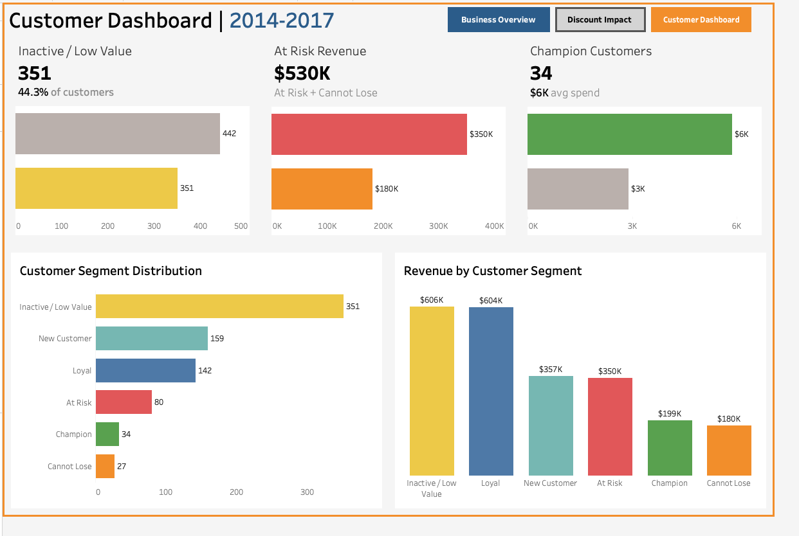

# Superstore Business Performance Analysis

**Four-year analysis of a $2.3M retail operation — identifying the root causes of profit leakage and delivering quantified, prioritized recommendations.**

Built as a senior-analyst portfolio project using the Tableau Sample Superstore dataset (9,993 transactions, 2014–2017). The analysis moves through a full analytics pipeline: data profiling and cleaning → exploratory analysis → statistical profitability analysis → customer segmentation → executive reporting → Tableau dashboards.

---

## Key Findings

| Finding | Evidence | Impact |
|---|---|---|
| Over-discounting is a measurable profit killer | OLS regression: Discount coeff = -236.29 (p < 0.0001); Welch's t-test confirms group difference | 1,392 orders at 30%+ discount generated **-$135,364 net loss** |
| Furniture margin has collapsed | Furniture margin = 2.49% vs Technology at 17.4% | Tables sub-category alone: **-$17,725 total profit** |
| Serious customer retention problem | 44% of customers are Inactive / Low Value | At Risk + Cannot Lose (107 customers) = **$530K at-risk revenue** |

---

## Project Structure

```
├── notebooks/
│   ├── 01_Data_profiling_&_cleaning.ipynb   # dtype fixes, dedup, feature engineering
│   ├── 02_eda.ipynb                          # category, region, segment, trend analysis
│   ├── 03_profitability.ipynb                # OLS regression, Welch's t-test, scenario table
│   ├── 04_customer_segmentation.ipynb        # RFM scoring and segment profiling
│   └── 05_executive_summary.ipynb            # KPI dashboard and written findings
├── outputs/
│   ├── figures/                              # saved charts and Tableau dashboard previews
│   └── reports/
│       ├── executive_summary.md              # polished written report
│       └── executive_summary.html            # notebook export
├── data/
│   ├── raw/                                  # original source CSV
│   └── processed/                            # cleaned data + RFM output
└── requirements.txt
```

---

## Methodology

**1 — Data Profiling & Cleaning**
Fixed dtype issues (dates, postal codes), identified and removed 1 true duplicate, engineered `Order Year`, `Order Month`, `Shipping Days`, and `Profit Margin` columns. Retained negative profit rows — they are real data, not errors.

**2 — Exploratory Data Analysis**
Aggregated performance across Category, Region, Customer Segment, and Sub-Category. Built a monthly sales trend chart to identify seasonality patterns.

**3 — Profitability Analysis**
- OLS regression with categorical encoding (Category, Region) — controlled estimate of discount's effect on profit
- Welch's t-test to confirm the high-discount vs low-discount profit difference is statistically significant (p < 0.0001)
- Break-even threshold analysis: profit turns negative between 20–30% discount
- Scenario table: Conservative / Base / Aggressive recovery estimates for a 20% cap pilot

**4 — Customer Segmentation (RFM)**
Scored customers on Recency, Frequency, and Monetary quartiles. Applied a rule-based segment classifier to assign Champion, Loyal, New Customer, At Risk, Cannot Lose, and Inactive / Low Value labels. Threshold values derived dynamically using `pd.qcut` — not hard-coded.

**5 — Executive Summary**
Consolidated KPI dashboard and written findings synthesizing results from notebooks 2–4. Outputs cleaned data and summary tables used as the data source for Tableau dashboards.

**6 — Tableau Dashboards**
Built a three-dashboard Tableau suite translating the analysis into business-facing visuals: Business Overview, Discount Impact Analysis, and Customer Dashboard.

---

## Tableau Dashboard Suite

The Tableau dashboard suite turns the notebook findings into an executive-facing workflow:

1. **Business Overview** — summarizes revenue, profit, margin, sub-category performance, and regional profitability.
2. **Discount Impact Analysis** — shows how average profit turns negative at higher discount rates and identifies discount-risk sub-categories.
3. **Customer Dashboard** — profiles RFM customer segments, inactive customers, at-risk revenue, and champion customer value.

[View the interactive Tableau dashboard](https://public.tableau.com/views/SuperStore_Analysis_17812343233970/BusinessOverviewDashboard?:language=en-US&:sid=&:redirect=auth&:display_count=n&:origin=viz_share_link)

### Business Overview



### Discount Impact Analysis



### Customer Dashboard



---

## Recommendations

1. **Pilot a 20% discount cap in Central region** — Central averages 24% discount vs 11% in West. One quarter of data will confirm whether margin improves without significant volume loss.
2. **SKU-level pricing review on Tables** — assess whether price increases or discount restrictions can recover margin before considering discontinuation.
3. **Retention campaign for At Risk + Cannot Lose customers** — 107 customers representing $530K in revenue showing disengagement signals.
4. **VIP program for Champions** — 34 customers averaging $5,863 spend each deserve dedicated retention attention.

---

## Tools & Libraries

| Layer | Tools |
|---|---|
| Data wrangling | Python, pandas, numpy |
| Visualization | matplotlib, seaborn |
| Statistics | scipy (Welch's t-test), statsmodels (OLS regression) |
| Dashboards | Tableau |
| Reporting | nbconvert |

---

## Reproduce

```bash
# Install dependencies
pip install -r requirements.txt

# Run notebooks in order (01 → 05)
# Each notebook saves its outputs before the next begins
```
